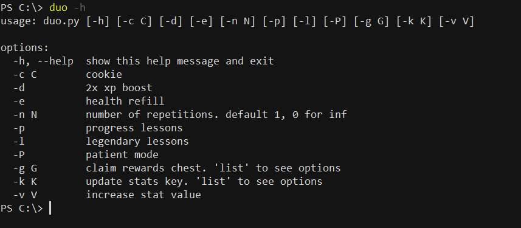

# duolingo

A script to help with Duolingo. It's main functions: 
* [auto-progression](#progress): progress through lessons in a course automatically, ~4 secs/lesson
* [xp farming](#xp): gain xp indefinitely, ~200xp/4 secs
* [gems](#gems): gain gems indefinitely, ~30 gems/3 secs
* [xp boost](#dbl): gain 3x xp boost for arbitrary amounts of time
* [health refill](#heal)
* [quests](#quests): add progress to friends, daily, or monthly quests

### Getting started
You'll need python with the [requests library](https://pypi.org/project/requests/) and a valid session cookie (stored as `jwt_token`) for the web version of duolingo. Set that as the value of the `cookie` variable in the script, or pass it through the command line as the value of the `-c` parameter. Run the script with `-h` to see the available options:

 

### auto-progression
Running the script with `-p` automatically clears the next successive lesson in your current course. To clear multiple successive lessons, pass the target number of lessons in `-n`. Setting `-n 0` makes the script clear successive lessons indefinitely until interrupted.

https://github.com/user-attachments/assets/bf775ffc-2b39-4cd4-a90d-6f47fd5b802b

 

### XP farming
Running the script with `-l` gains you 200xp without making progress in your current course (by clearing an earlier legendary lesson). To do this multiple times, pass the target number of lessons in `-n`, or set `-n 0` to gain 200xp indefinitely. Running the script without arguments, or just with `-n`, clears global practice lessons, gaining you 15xp and 1 health.

https://github.com/user-attachments/assets/012b3a30-dd8e-4b1d-a6f1-03184a5aa527

 

### gems
Run the script with `-g list` to see what chests are available for you to claim. 

Pass the index of the chest you want to claim to `-g` to claim the chest. Some chests can be claimed multiple times--pass the number of times you want to claim the same chest (if available) to `-n`, or `-n 0` to claim indefinitely. So far, it seems like the 30-gem `SKILL_COMPLETION_BALANCED` chest can be claimed indefinitely. Run the script with `-g skill -n [#]` to claim that chest multiple times.

https://github.com/user-attachments/assets/e0ce294b-3c24-42cf-a4e8-a80a014347ed

 

### XP boost
Run the script with `-d` to add an xp boost to your account. If you are logged in to the mobile version of the app, `-d` adds a triple xp boost for 15 mins. You can change the duration of the boost by specifying the desired number of minutes in `-v`. If the triple xp boost fails, `-d` adds a double xp boost to your account for 15 mins.

https://github.com/user-attachments/assets/bb25eda4-8a3d-4a94-85c3-aa8e25733210

 

### health refill
Run the script with `-e` to refill your health.

https://github.com/user-attachments/assets/0583b167-a3e4-45ea-b096-bd3c2c2aafe4

 

### quests
Run the script with `-k list` to see what quest values you can modify.

Pass the index of the value you want to modify to `-k`, and pass the number by which you want to increase it to `-v`.

https://github.com/user-attachments/assets/7cd7f0d7-c926-4907-b876-62c29a8555b2

